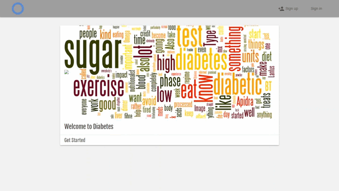

# Diabetes
This is a web app to help people with diabetes to keep monitor their glucose blood level.

## Features
- Login / Registration forms 
- View / edit user's profile 
- Add / view blood glucose level and insulin injection
- Add / view additional information (blood pressure, glycated hemoglobin, pulse, weight)
- View the average, min, max glucose level over a period of time
- View glucose level charts 

## Technology
- Node.js
- JavaScript
- MySQL
- HTML
- CSS

## Demo

